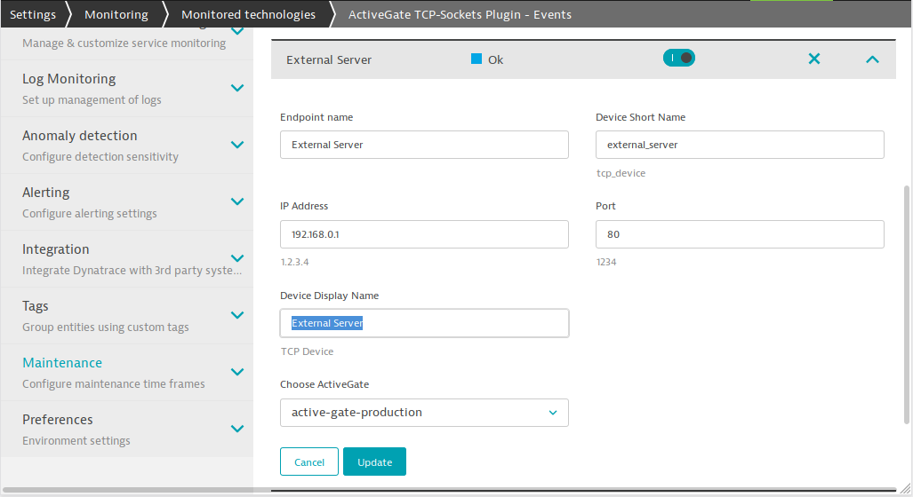
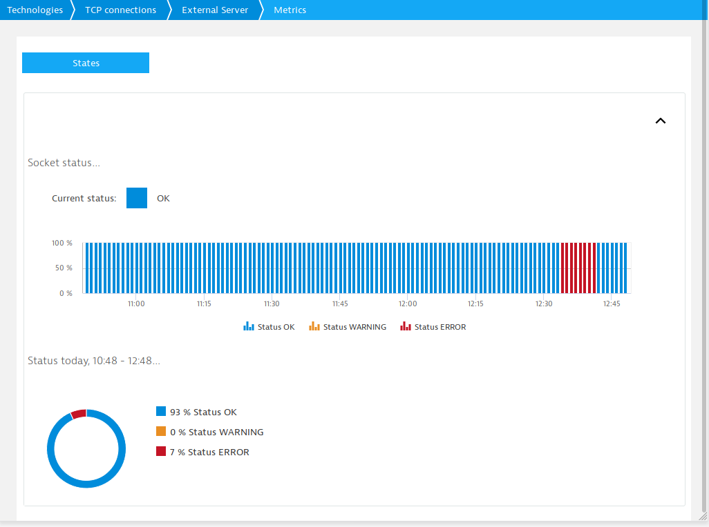
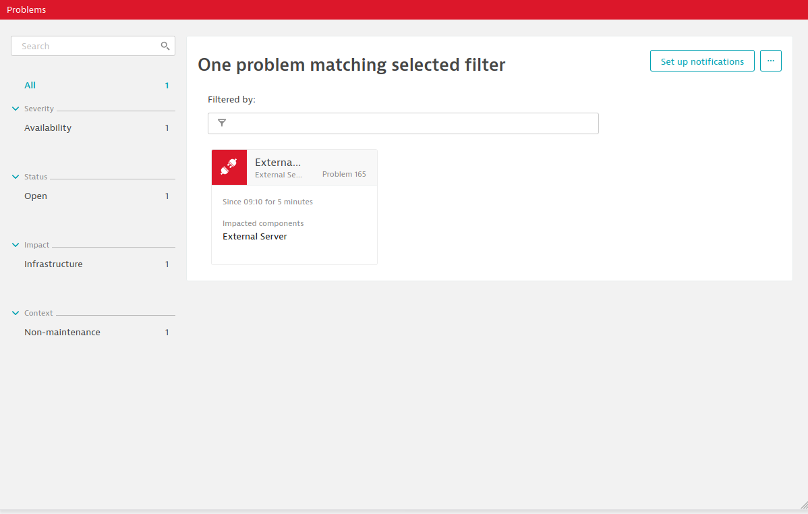
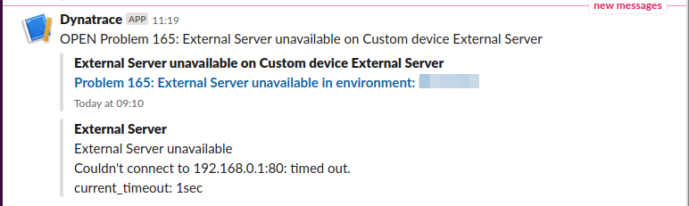

# Simple TCP monitoring plugin for Dynatrace ActiveGate

This plugin tries to open a tcp socket from a Dynatrace ActiveGate to the ip
address and port configured. 

It reports an *OK availability event* to Dynatrace if successful, *ERROR* otherwise.

## Installation

### Prerequisites

You'll need:

* A [Dynatrace](https://www.dynatrace.com/) account and at least one [Environment ActiveGate](https://www.dynatrace.com/support/help/setup-and-configuration/dynatrace-activegate/installation/install-an-environment-activegate/)
* Dynatrace [Plugin SDK](https://www.dynatrace.com/support/help/extend-dynatrace/plugins/activegate-plugins/development/activegate-plugin-sdk-overview/) and an [API Token](https://www.dynatrace.com/support/help/extend-dynatrace/dynatrace-api/basics/dynatrace-api-authentication/) for installation/upload 

### Package and upload the plugin to your Dynatrace environment

Create two files holding the URL to the dynatrace server and your API token:

```bash
$ cat .server 
SERVER=https://tenantid.live.dynatrace.com:443/api/v1/remoteplugins
$ cat .api_token 
ent3ry0urap1t0k3nh3r3
```

Run make to package and upload the plugin:

```bash
$ make
```

### Upload the plugin to the ActiveGate

In addition the plugin needs to be uploaded to the ActiveGate and extracted into
the remote plugin directory:

```bash
$ scp .deployment/custom.remote.python.tcp_socket.zip my-active-gate.example.com:
custom.remote.python.tcp_socket.zip                100% 4147    88.1KB/s   00:00 
$ ssh my-active-gate.example.com
my-active-gate$ sudo unzip -uo custom.remote.python.tcp_socket.zip -d /opt/dynatrace/remotepluginmodule/plugin_deployment/
my-active-gate$ sudo systemctl restart dynatracegateway
```

## Usage

### Configuration

You need to configure one or more endpoints for the plugin to monitor. In the
Dynatrace UI navigate to Settings / Monitoring / Monitored Technologies / Custom Plugins
and select the `ActiveGate TCP-Sockets Plugin` from the list.

`Add new endpoint` gives you the Endpoint configuration Screen. The most important
parameters are of course `IP Address` and `Port` to monitor. `Device Display Name`
is what will show up in alerts and charts.

 

### Chart Display

Navigate to Technologies / TCP connections then press `Group details` and select
the desired device.

Currently only states *OK* and *ERROR* are used, *WARNING* is for future use only.



## Problem ticket and Alerting

When the plugin reports an error, Dynatrace will automatically open a problem ticket
as you can see on the problem screen:



The ticket ties into Dynatrace's powerful alerting system. Just as for any other
problem Dyntrace detects you can configure it to alert you eg on Slack:


